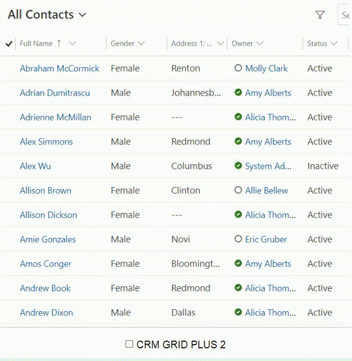

CRM GRID PLUS 2 transforms your Dynamics CRM/CDS grid with a new look and feel, offering advanced row formatting for alternating colors and enhanced readability, plus conditional formatting options to customize text styles and colors based on specific criteria.

### Working with Dynamics CRM/CDS, grids are a ubiquitous feature. You will encounter them in various contexts, including:
* Dashboard Grids
* Entity Main List Grids
* Form Grids
* Associated Grids
* Advanced Find Grids
* Lookup Window Grids

### By default, you have the following capabilities
* Add or Remove Columns
* Reorder Columns
* Sort Columns
* Adjust Column Widths

### However, you may desire additional functionalities such as
* **Row Formatting**: Apply alternating colors to odd and even rows for better readability
* **Conditional Formatting**: Format rows based on conditions with options like bold, italic, text color, and background color

### With 🎀CRM GRID PLUS 2🎀, you can do that

# DEMO ENVIRONMENT
* Url: **https://demo-crmgridplus2.crm5.dynamics.com**
* Email: **demo@crmgridplus.com**
* Password: **Aa@112233!**

# PARAMETERS
* [ADD_DAY](/parameters/add_days/README.md)
* [CURRENT_DAY](/parameters/current_day/README.md)
* [CURRENT_MONTH](/parameters/current_month/README.md)
* [CURRENT_DAYMONTH](/parameters/current_daymonth/README.md)
* [CURRENT_HOUR](/parameters/current_hour/README.md)
* [CURRENT_MINIUTE](/parameters/current_miniute/README.md)
* [CURRENT_MONTH](/parameters/current_month/README.md)
* [CURRENT_MONTHYEAR](/parameters/current_monthyear/README.md)
* [CURRENT_USER](/parameters/current_user/README.md)
* [CURRENT_YEAR](/parameters/current_year/README.md)
* [TODAY](/parameters/today/README.md)

# DOWNLOAD
* [Release](https://github.com/phuocle/Crm-Grid-Plus/releases)