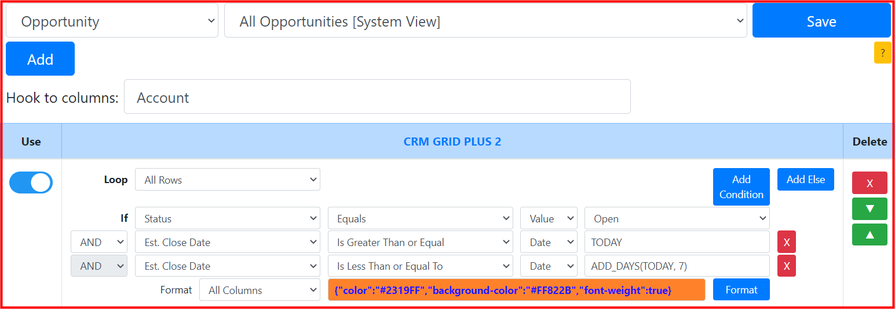
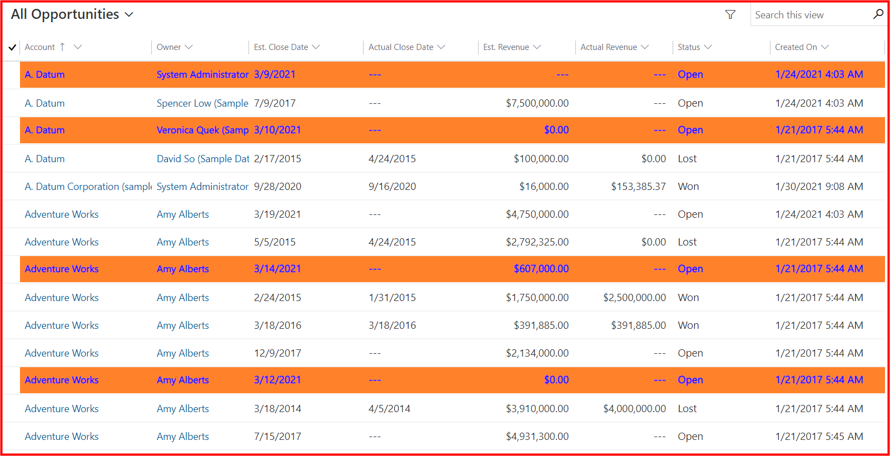
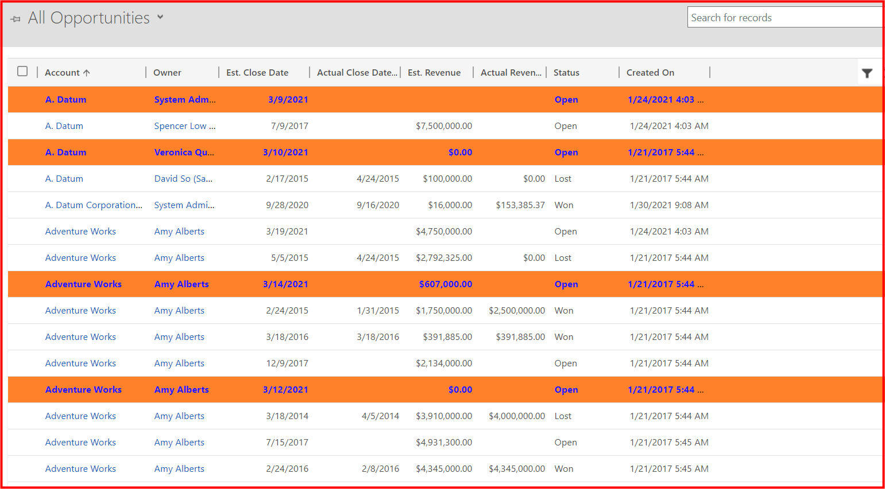
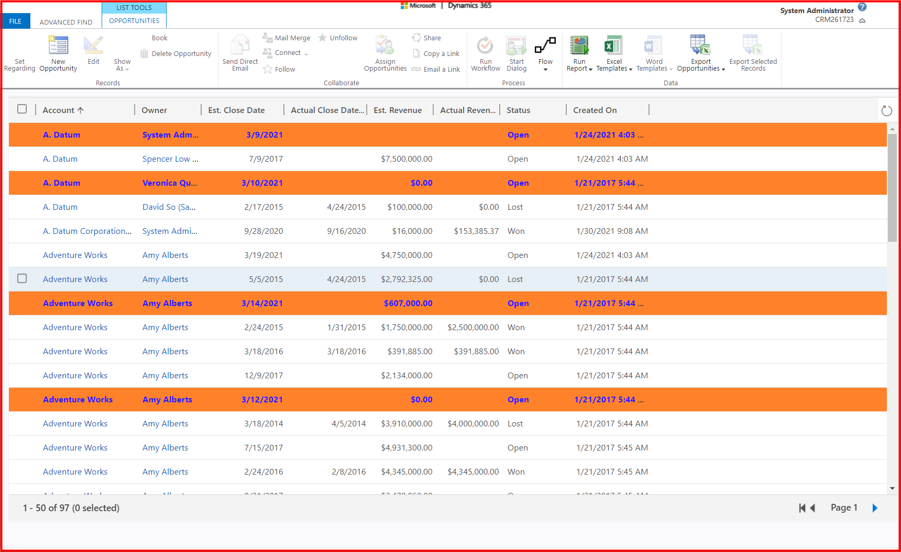

## Requirement
* System view: ```All Opportunies```
* Highlight rows: ```Est. Close Date from today to next 7 days with status Open```
## Setting

## Result
**CRM GRID PLUS 2** format with the requirements in the **UCI grid**


**CRM GRID PLUS 2** format with the requirements in the **classic grid**


**CRM GRID PLUS 2** format with the requirements in the **Advance Find**


## Notes
* Today is ```Mar 09, 2021```
* Should use a **build-in** function: ```TODAY```, ```ADD_DAYS```
* Should select ```Date``` data type