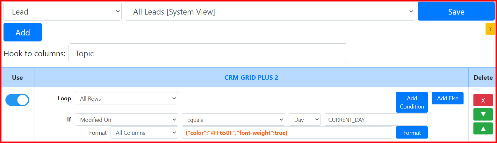
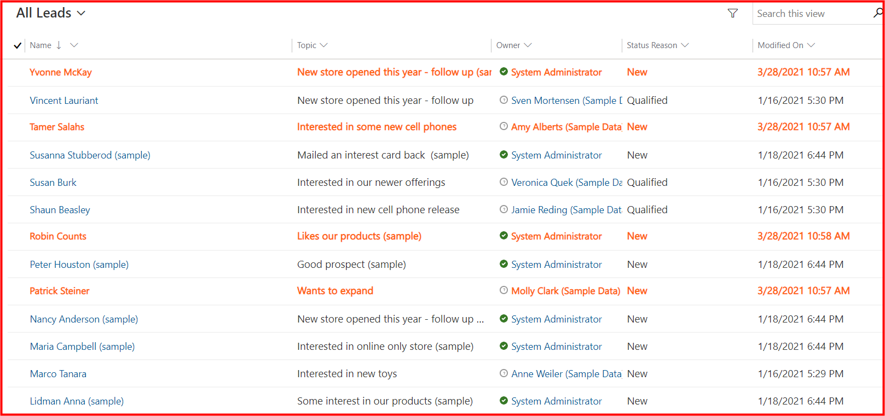
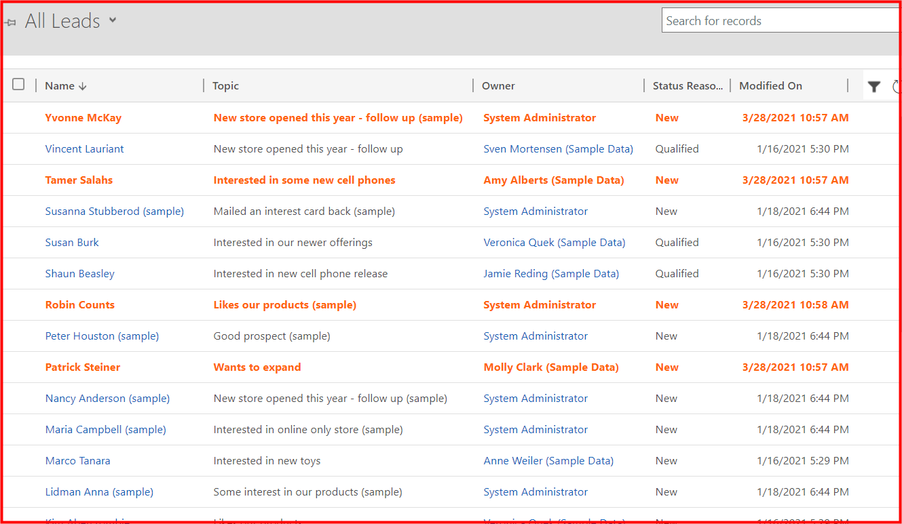
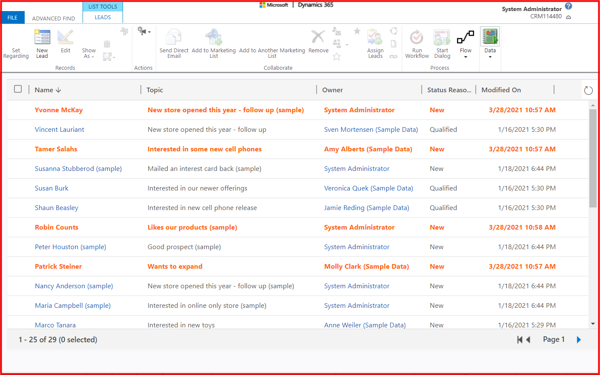

## Requirement
* System view: ```All Leads```
* Highlight rows: ```Modified On equals current day```
## Setting

## Result
**CRM GRID PLUS 2** format with the requirements in the **UCI grid**


**CRM GRID PLUS 2** format with the requirements in the **classic grid**


**CRM GRID PLUS 2** format with the requirements in the **Advance Find**


## Notes
* Current Day is ```28```
* Should use a **build-in** function: ```CURRENT_DAY```
* Should select ```Day``` data type