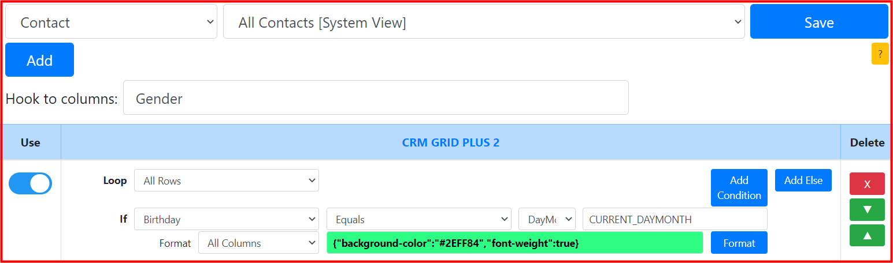
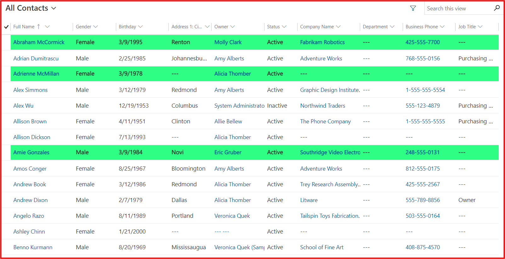
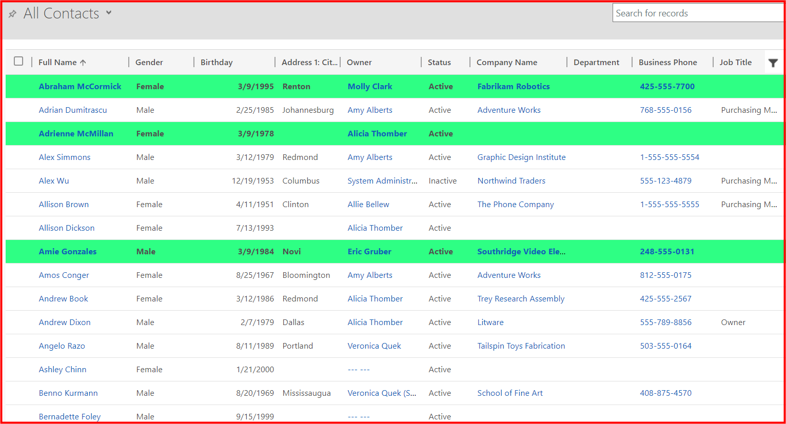
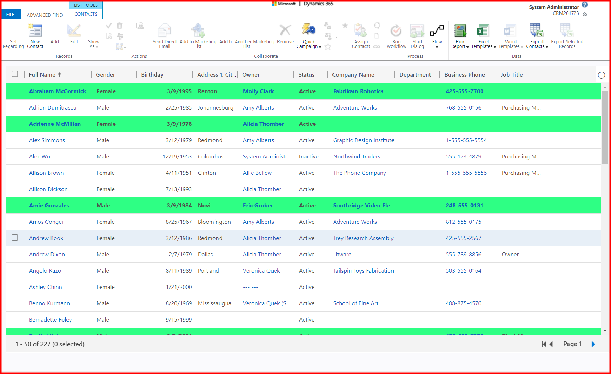

## Requirement
* System view: ```All Contacts```
* Highlight rows: ```Who's birthday today?```

## Setting


## Result
**CRM GRID PLUS 2** format with the requirements in the **UCI grid**


**CRM GRID PLUS 2** format with the requirements in the **classic grid**


**CRM GRID PLUS 2** format with the requirements in the **Advanced Find**


## Notes
* Today is ```Mar 09, 2021```
* Should use a **build-in** function: ```CURRENT_DAYMONTH```
* Should select ```DayMonth``` data type