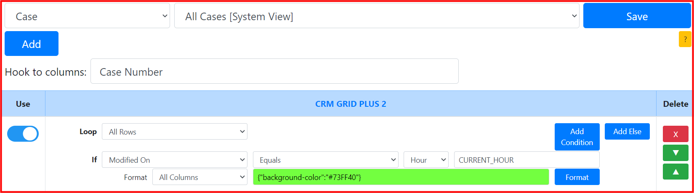
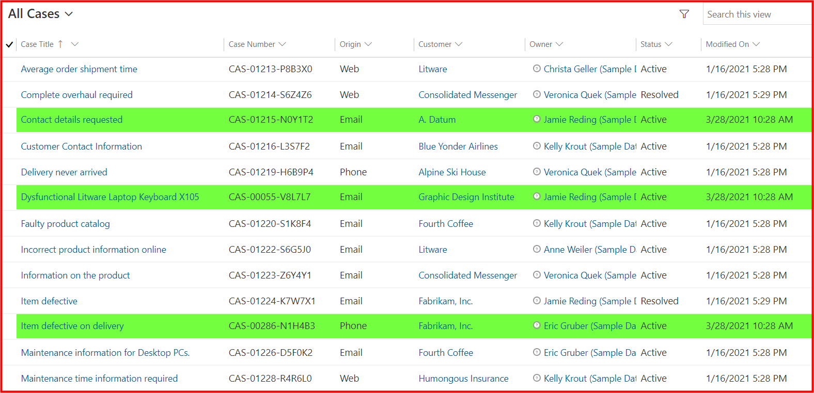
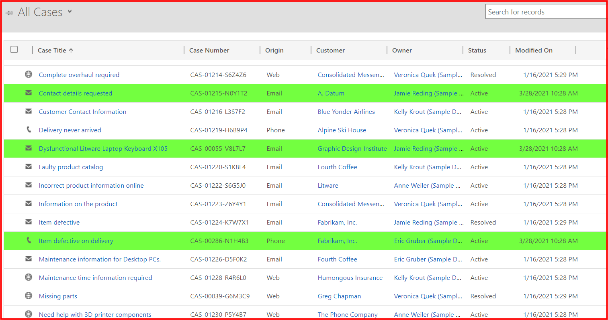
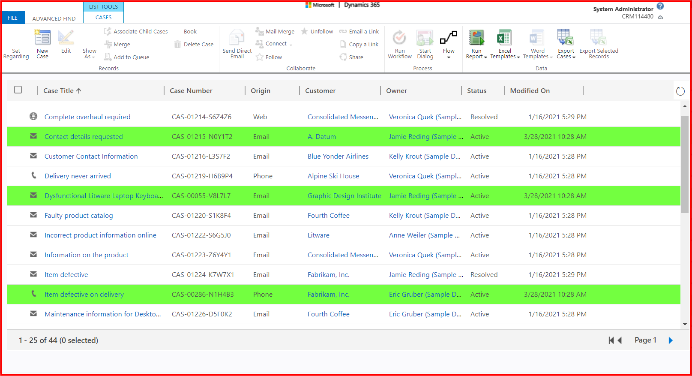

## Requirement
* System view: ```All Case```
* Highlight rows: ```Modified On equals current hour```

## Setting


## Result
**CRM GRID PLUS 2** format with the requirements in the **UCI grid**


**CRM GRID PLUS 2** format with the requirements in the **classic grid**


**CRM GRID PLUS 2** format with the requirements in the **Advance Find**


## Notes
* Current Hour is ```10```
* Should use a **build-in** function: ```CURRENT_HOUR```
* Should select ```Hour``` data type