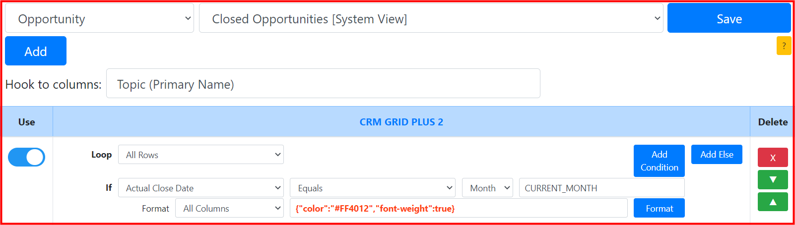
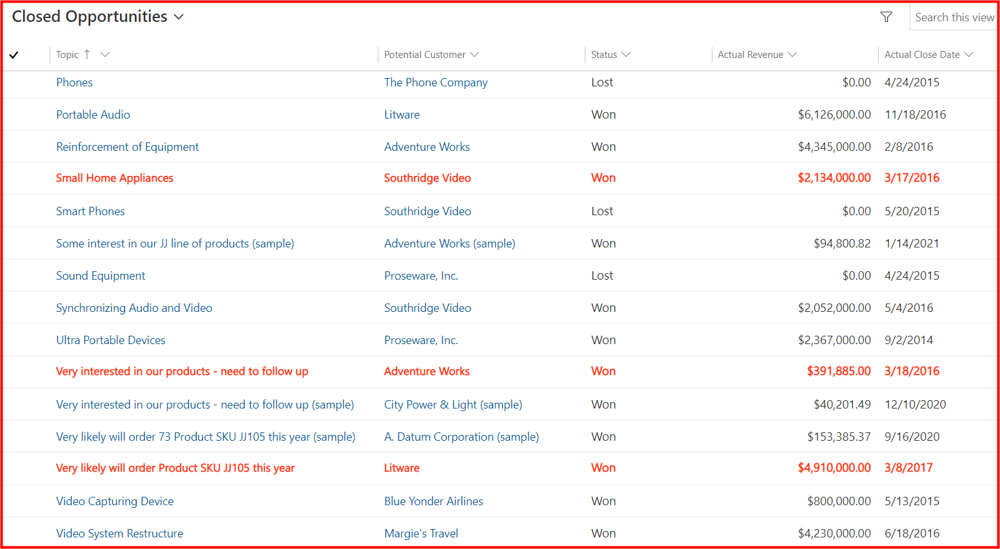
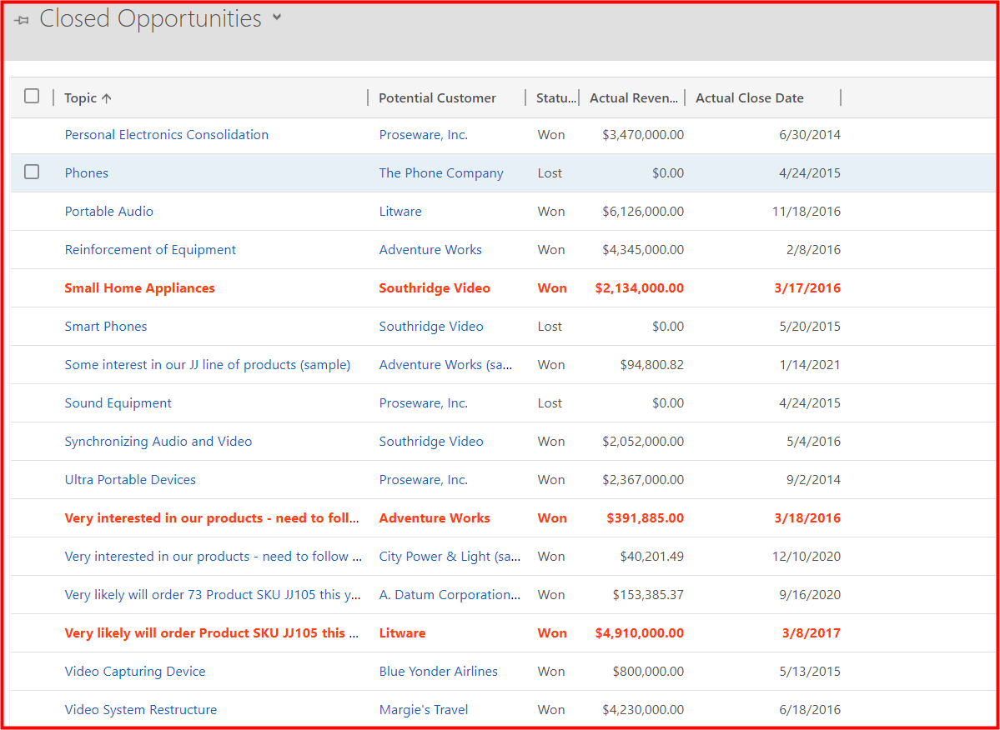
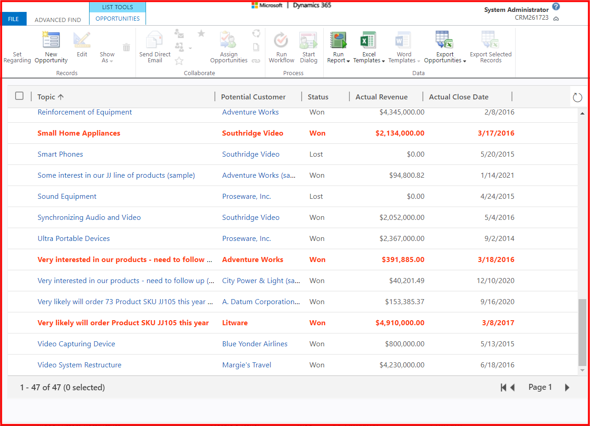

## Requirement
* System view: ```Closed Opportunities```
* Highlight rows: ```Actual Close Date equals current month```

## Setting


## Result
**CRM GRID PLUS 2** format with the requirements in the **UCI grid**


**CRM GRID PLUS 2** format with the requirements in the **classic grid**


**CRM GRID PLUS 2** format with the requirements in the **Advance Find**


## Notes
* Current Month is ```3```
* Should use a **build-in** function: ```CURRENT_MONTH```
* Should select ```Month``` data type