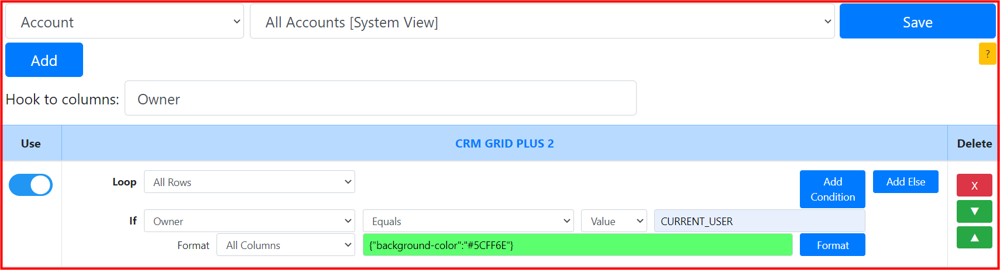
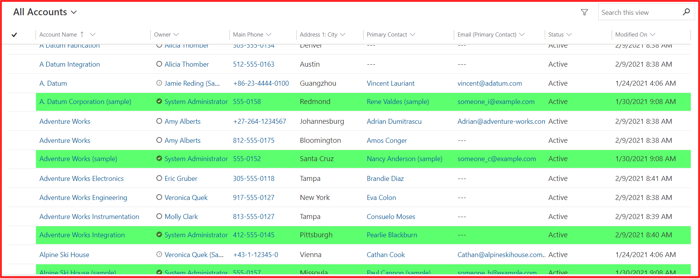
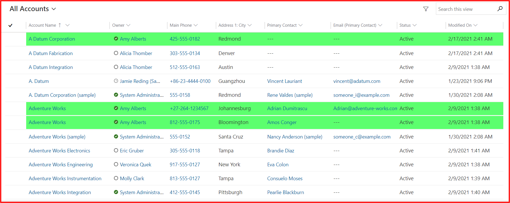
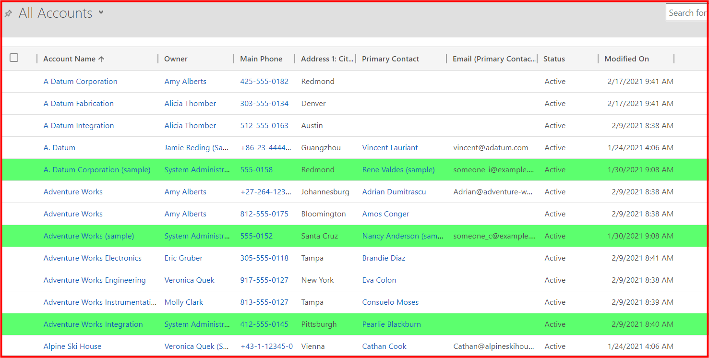
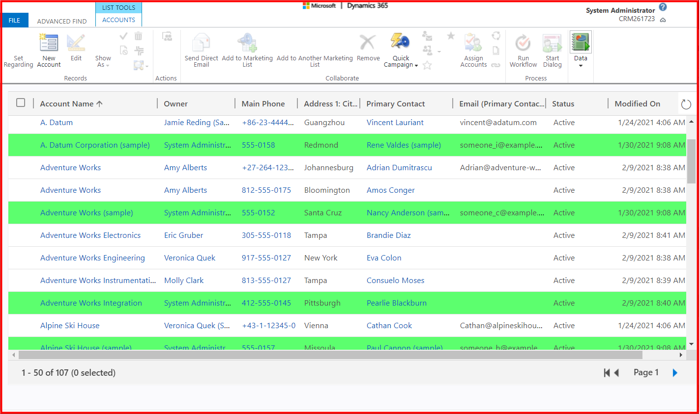

## Requirement
* System view: ```All Accounts```
* Highlight rows: ```Owner equals current user```
## Setting

## Result
**CRM GRID PLUS 2** format with the requirements in the **UCI grid** (current user login: **System Administrator**)


**CRM GRID PLUS 2** format with the requirements in the **UCI grid** (current user login: **Amy Alberts**)


**CRM GRID PLUS 2** format with the requirements in the **classic grid**


**CRM GRID PLUS 2** format with the requirements in the **Advanced Find**


## Notes
* Current login user is ```System Administrator``` or ```Amy Alberts```
* Should use a **build-in** function: ```CURRENT_USER```