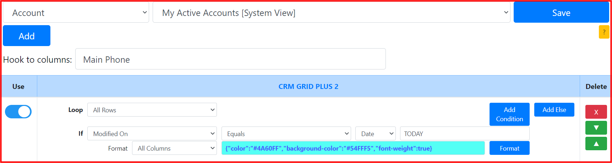
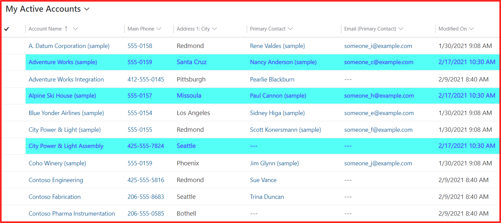
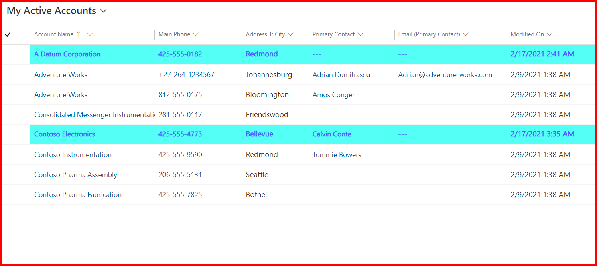
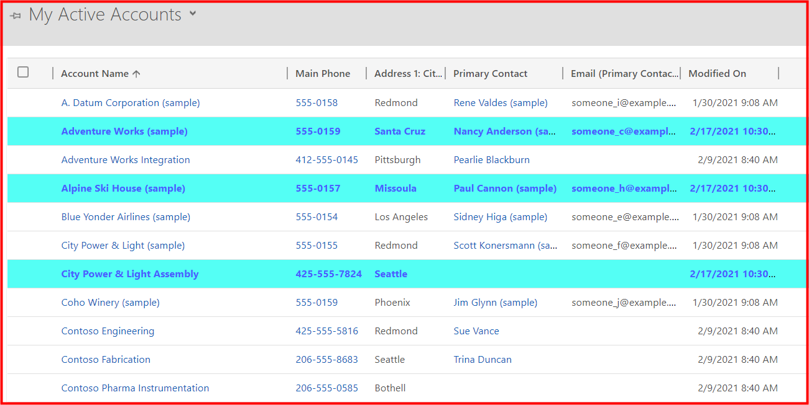
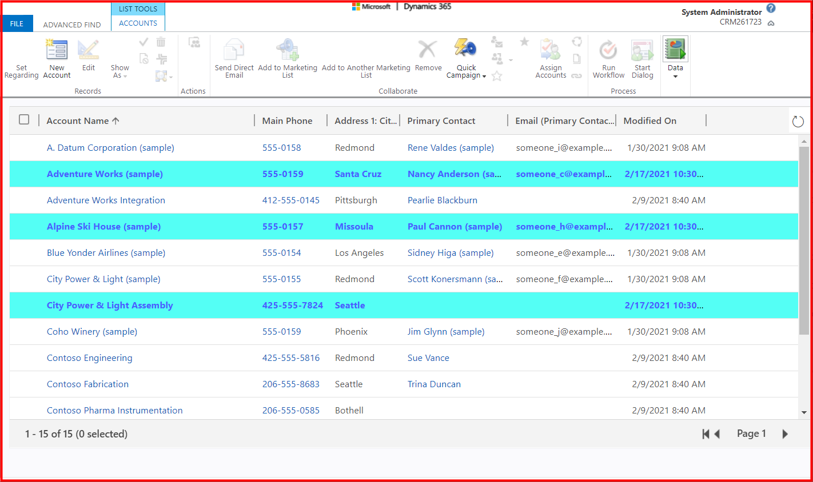

## Requirement
* System view: ```My Active Accounts```
* Highlight rows: ```Modified On equals today```

## Setting


## Result
**CRM GRID PLUS 2** format with the requirements in the **UCI grid** (current user login: **System Administrator**)


**CRM GRID PLUS 2** format with the requirements in the **UCI grid** (current user login: **Amy Alberts**)


**CRM GRID PLUS 2** format with the requirements in the **classic grid**


**CRM GRID PLUS 2** format with the requirements in the **Advanced Find**


## Notes
* Today is ```Feb-17 2021```
* Should use a **build-in** function: ```TODAY```